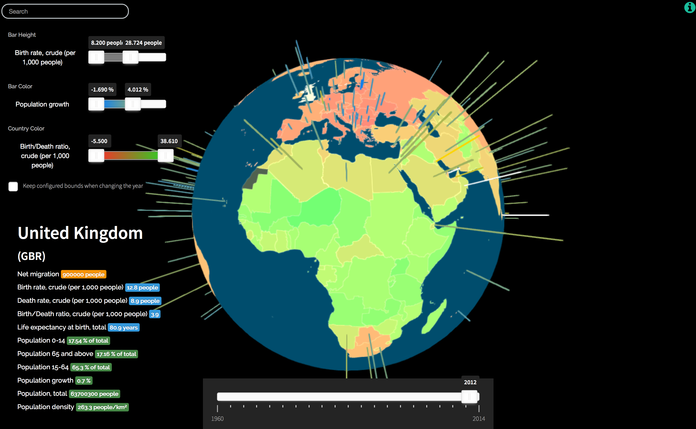

# Living Globe

Living Globe is an application for tri-dimensional worldwide demographical data
visualization. It allows the simultaneous representation of multiple
indicators, like total population, density, population-growth, life expectancy,
net migration, crude birth rate, crude death rate and the ratio between the
last two. The mapping of data to the provided visual structures is configurable
by the user, introducing an aspect of customization which encourages a more
immediate, visual-only interpretation of the data. Additionally, the
represented data is normalized within an adjustable scale. This can be used to
filter out extremely high or extremely low samples, uniforming the remaining
data and improving its visibility.

__Living-Globe is available at [http://edduarte.com/living-globe/](http://edduarte.com/living-globe/)__
 

# Publication

#### Living Globe: Tridimensional Interactive Visualization of World Demographic Data  
##### Eduardo Duarte, Pedro Bordonhos, Paulo Dias, Beatriz Sousa Santos  
Human Interface and the Management of Information:Information, Design and Interaction  
Volume 9734 of the series Lecture Notes in Computer Science pp 14-24  
Date: 21 June 2016  
https://link.springer.com/chapter/10.1007%2F978-3-319-40349-6_2

# Description

Living Globe allows the visual exploration of the following demographics data: population, population density and growth, birth and death rates, life expectancy, migration flow, crude mortality and crude birth rates. It is targeted to users having at least a minimum of computer and statistics literacy. While offering unexperienced users a default mapping of these data variables into visual variables, Living Globe allows more advanced users to select the mapping they intent to use. This means that these users have the possibility of control over an earlier stage of the visualization reference model (Riccardo Mazza. Introduction to information visualization. Springer-Verlag London, 1, 2009) making Living Globe a more flexible tool.

In order to support this feature, three visual variables may be selected to map a data type: i) height of vertical bars (directly proportional to the data value) ii) color of vertical bars (in a color scale ranging from blue to yellow) and iii) color of the countries on the globe (in a scale ranging from red to green). An adequate selection of the data variables and their mapping to the visual variables may help the identification and study of potential relations among data variables. The time interval may be selected using a slider.

Living Globe also offers the following functionality: i) configuration of minimum and maximum data values that should be visualized; ii) textual search, with dynamic suggestion of the countries names; and iii) country selection. The former functionality is important, for instance, to improve the visualization of data in countries with small samples (eg. Portugal) by filtering out countries with large samples (e.g. China).

# Evaluation

The usability of this tool was tested by agnostic individuals, and the results
indicate that the data filtering and customizable mapping features encourage a
faster interpretation of relational information. Moreover, this tool improves
on previous state-of-the-art work by implementing interaction capabilities like
selection, search and filtering.

# Future Work

- allow user configuration of color scales;
- remove dependencies on demographic data, making Living Globe a generic API that allows the input of any kind of data.

# License

    Copyright 2015 University of Aveiro

    Licensed under the Apache License, Version 2.0 (the "License");
    you may not use this file except in compliance with the License.
    You may obtain a copy of the License at

       http://www.apache.org/licenses/LICENSE-2.0

    Unless required by applicable law or agreed to in writing, software
    distributed under the License is distributed on an "AS IS" BASIS,
    WITHOUT WARRANTIES OR CONDITIONS OF ANY KIND, either express or implied.
    See the License for the specific language governing permissions and
    limitations under the License.
