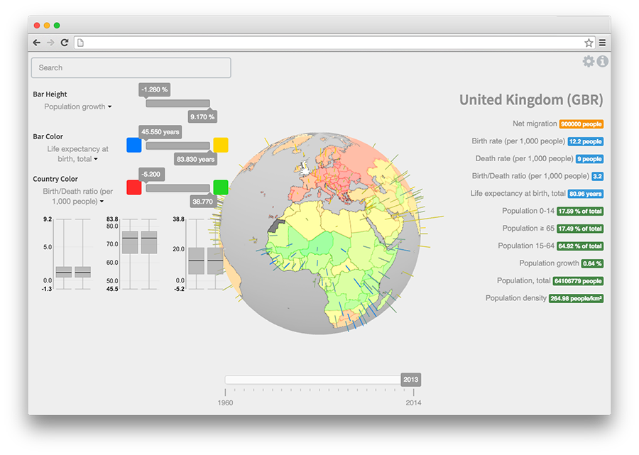

# Living Globe

**Demo: [https://edduarte.github.io/living-globe/](https://edduarte.github.io/living-globe/)**

[https://edduarte.github.io/living-globe/](  )

Data visualization application that allows the simultaneous representation of
multiple spatial indicators on a 3D globe. The mapping of data to the provided
visual structures is configurable by the user, introducing an aspect of
customization which encourages a more immediate, visual-only interpretation of
the data. The user can also filter out extremely high or extremely low samples,
normalizing the remaining data and improving its visibility.

This application has been developed as part of a research paper (E. Duarte, P.
Bordonhos, P. Dias, B. S. Santos, *Living Globe: Tridimensional Interactive
Visualization of World Demographic Data*) and presented at HCI International
2016, The Westin Harbour Castle Hotel, Toronto, Canada. [**Links to the
publication and the talk slides are available on my
blog**](https://edduarte.com/living-globe).

## License

    Copyright 2016 University of Aveiro

    Licensed under the Apache License, Version 2.0 (the "License");
    you may not use this file except in compliance with the License.
    You may obtain a copy of the License at

       http://www.apache.org/licenses/LICENSE-2.0

    Unless required by applicable law or agreed to in writing, software
    distributed under the License is distributed on an "AS IS" BASIS,
    WITHOUT WARRANTIES OR CONDITIONS OF ANY KIND, either express or implied.
    See the License for the specific language governing permissions and
    limitations under the License.
